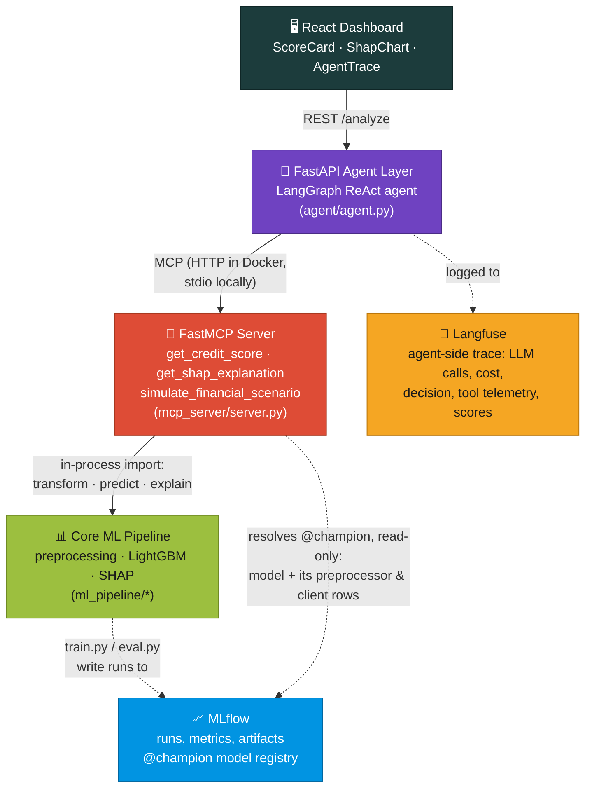

# FinRisk-Agent

**AI-powered credit scoring, with an AI agent you can ask questions**

A demo project showing how a classic machine learning model (predicting
whether a small business will default on a loan) can be paired with an AI
agent that explains the score in plain language, answers "what if"
questions, and justifies its recommendation — with every step logged and
checkable, not a black box.

[](https://github.com/Totm33606/finrisk-agent/actions/workflows/ci.yml)
[](https://www.python.org/)
[](LICENSE)
[](https://docs.astral.sh/uv/)
[](https://lightgbm.readthedocs.io/)
[](https://gofastmcp.com/)
[](https://langchain-ai.github.io/langgraph/)
[](https://mlflow.org/)
[](https://langfuse.com/)
[](https://docs.astral.sh/ruff/)
[](https://mypy-lang.org/)

https://github.com/user-attachments/assets/0191bc9e-62a0-4fcd-98ea-251818ce8eef

---

## Table of contents

- [Why this project](#why-this-project)
- [Glossary](#glossary)
- [Architecture](#architecture)
- [Repository structure](#repository-structure)
- [Quickstart](#quickstart)
  - [Option A — uv (local dev)](#option-a--uv-local-dev)
  - [Option B — Docker Compose](#option-b--docker-compose)
- [Data](#data)
- [ML pipeline](#ml-pipeline)
- [MLOps — tracking & model registry](#mlops--tracking--model-registry)
- [MCP server](#mcp-server)
- [Agent & observability](#agent--observability)
- [Dashboard](#dashboard)
- [Evaluation](#evaluation)
- [Testing & quality gates](#testing--quality-gates)
- [Technical choices & trade-offs](#technical-choices--trade-offs)
- [License](#license)

---

## Why this project

Most "LLM + ML" demos stop at a notebook, or wrap a model in a chatbot with
no real structure underneath. This one is built closer to how an actual
credit-decisioning tool would be:

- **The prediction itself never touches an LLM.** A classic, well-tested ML
  model (LightGBM) does the actual risk assessment — the AI only reads and
  explains its output, never invents a number.
- **The model and the agent are cleanly separated** (via MCP, see
  [Glossary](#glossary)) — you can swap out the AI agent, or retrain and
  redeploy the model, without touching the other side.
- **Every step the agent takes is logged and reviewable.** You can see
  exactly which questions it asked the model, in what order, and why it
  reached its conclusion — not a black box.
- **The dashboard shows the model's real output, not the AI's guess.** The
  charts are built from the same data the agent received, not a second,
  potentially-inconsistent call.

## Glossary

Quick definitions for terms used throughout this README — skip if you're
already familiar with them.

**Finance**
- **Default**: a company failing to repay its loan. "Credit risk" is the
  risk of this happening.
- **PD (Probability of Default)**: the model's predicted chance (0–100%)
  that a given client defaults.
- **Risk band**: a simple LOW / MEDIUM / HIGH / CRITICAL label derived from
  the PD — easier to scan than a raw percentage.
- **EBITDA margin, debt-to-equity, current ratio, DSO/DPO**: standard
  accounting ratios lenders use to gauge profitability, debt load,
  liquidity, and how fast a company pays/gets paid. Full plain-language
  definitions are in [Data](#data).

**Machine learning**
- **SHAP**: a technique that explains *why* a model gave a particular
  score, by showing how much each input pushed the prediction up or down.
- **PR-AUC / ROC-AUC**: two standard 0–1 scores (higher = better)
  summarizing how well the model tells risky and safe clients apart.
  PR-AUC is the more honest one here because actual defaults are rare —
  see [Evaluation](#evaluation).
- **Optuna / hyperparameter tuning**: an automated search that tries many
  model settings and keeps the best-performing combination, instead of
  guessing by hand.

**AI agent**
- **LLM**: a large language model (e.g. GPT) — the "brain" the agent uses
  to decide what to do next.
- **AI agent**: here, an LLM that can call tools (like "get this client's
  credit score") instead of just generating text — it looks things up
  rather than guessing.
- **MCP (Model Context Protocol)**: a standard way to expose tools (like
  the scoring model) so any AI agent can use them, independent of which
  LLM provider you pick.
- **LangGraph**: the library used to build the agent's reasoning loop
  (ask → call a tool → read the result → decide the next step, a pattern
  called *ReAct*).
- **Langfuse**: a dashboard for reviewing past AI runs — which tools were
  called, how long each step took, what the tokens cost, and what the agent
  concluded. [Agent & observability](#agent--observability) is precise about
  which of those signals this repo records and which it doesn't.
- **MLflow**: the same idea, but for the *statistical model* rather than the
  AI agent — it keeps a numbered history of every training run (settings
  used, accuracy obtained, charts produced) and a registry that records
  which specific run is the one currently making live decisions.

## Architecture



*(Every arrow points from the initiator to what it depends on. Two of them
are worth reading carefully. `ml_pipeline` appears once but wears two hats:
`train.py`/`eval.py` **write** runs into MLflow, while `preprocessing`,
`models` and `shap_explainer` are **imported** by the scoring server and
execute inside its process — a SHAP explanation is computed live there, not
read back from a run. And the scoring server **reads** MLflow rather than
being pushed to: it resolves `@champion` itself, against a store it mounts
read-only, which is why that arrow runs MCP → MLflow and not the reverse.
Note too that the tracing arrow starts at the agent, not the MCP server: the
scoring server emits plain application logs and is not instrumented — see
[Agent & observability](#agent--observability).)*

Four layers, each independently replaceable. **Why split it up this way:**

- **MCP as the seam, not framework-specific tools.** Wrapping the model
  behind MCP — instead of wiring Python functions directly into one agent
  framework — means the scoring service can be deployed and updated on its
  own schedule. Swap the agent framework for a different one later, and the
  model side doesn't change at all.
- **The agent never invents numbers.** It's instructed to ground every
  claim in a real tool call; `simulate_financial_scenario` exists so that
  "what if revenue drops 15%?" questions re-run the real model instead of
  the AI guessing a direction.
- **Explanations are computed once, on the model side, not by the AI.**
  SHAP runs inside the scoring tool, so the "why" behind a score is exact
  and reproducible no matter which AI model or agent asks for it.

## Repository structure

```
finrisk-agent/
├── pyproject.toml            # single source of truth for deps (uv-managed)
├── Makefile                  # make dataset / train / eval / mcp / api / test
├── src/
│   ├── common/schemas.py     # shared data models (ML ↔ MCP ↔ Agent ↔ UI)
│   ├── ml_pipeline/
│   │   ├── config.py         # typed, env-overridable settings
│   │   ├── make_dataset.py   # synthetic SME credit dataset generator
│   │   ├── preprocessing.py  # data cleanup/encoding pipeline
│   │   ├── train.py          # training + tuning → publishes one MLflow run
│   │   ├── eval.py           # scores a registry alias, records on its run
│   │   ├── tracking.py       # the MLflow store: runs, artifacts, @champion
│   │   └── shap_explainer.py # per-client "why this score" explanations
│   ├── mcp_server/
│   │   ├── scoring_service.py # model+preprocessor+explainer, testable in isolation
│   │   └── server.py          # the 3 tools + 1 resource exposed to the agent
│   └── agent/
│       ├── agent.py           # the AI agent + its web API (MCP over HTTP or stdio)
│       └── observability.py   # Langfuse trace, tool telemetry, run scores
├── frontend/                  # Vite + React + Tailwind dashboard
│   └── src/
│       ├── App.jsx
│       └── components/{ScoreCard,ShapChart,AgentTrace}.jsx
├── mlruns/                    # (generated) MLflow store: every run + the registry
├── tests/                     # pytest: ML pipeline, MCP server, agent (all hermetic)
├── docker/                    # Dockerfile.backend (uv multi-stage) + Dockerfile.frontend + compose
└── .github/workflows/ci.yml   # lint, typecheck, test on every push
```

## Quickstart

### Option A — uv (local dev)

```bash
git clone https://github.com/<you>/finrisk-agent.git
cd finrisk-agent
cp .env.example .env          # fill in your LLM + (optional) Langfuse keys

uv sync --locked --extra dev                # installs exactly what uv.lock pins
uv run python -m ml_pipeline.make_dataset   # generates data/clients.parquet (synthetic)
uv run python -m ml_pipeline.train          # publishes an MLflow run, registers it @champion
uv run python -m ml_pipeline.eval           # scores @champion, records results on its run
uv run mlflow ui --port 5000                # browse runs and the registry on :5000

uv run python -m mcp_server.server          # sanity-check: runs the MCP server over stdio
uv run uvicorn agent.agent:api --reload --port 8080   # starts the agent API on :8080

cd frontend && npm install && npm run dev   # dashboard on :5173
```

On Linux/macOS/WSL with `make` installed, the [Makefile](Makefile) wraps the
same `uv run ...` commands under shorter names (`make install`, `make dataset`,
`make train`, `make tune`, `make eval`, `make mlflow-ui`, `make mcp`,
`make mcp-http`, `make agent`, `make api`, `make test`, `make lint`,
`make typecheck`, `make fmt`, `make clean`, `make docker-build`,
`make docker-up`, `make docker-train`, `make docker-eval`; `make train
ALIAS=challenger` and `make eval ALIAS=challenger` pass the registry alias
through, `mcp`/`mcp-http`/`docker-train`/`docker-eval` included) — CI itself
calls `uv`/`pytest` directly (see [ci.yml](.github/workflows/ci.yml)), so
`uv` is the one command that's guaranteed to work everywhere, including
native Windows where `make` isn't available out of the box.

### Option B — Docker Compose

```bash
cp .env.example docker/.env                   # note the path — see below
uv run python -m ml_pipeline.make_dataset     # required: populates data/
make docker-train                             # required: populates mlruns/
docker compose -f docker/docker-compose.yml up --build
```

**`docker/.env`, not `.env` — this trips people up.** Compose resolves the
`${VAR}` substitutions in `docker-compose.yml` against a `.env` file in its
*project directory*, which defaults to the directory holding the compose
file (`docker/`), **not** the repo root and not your shell's working
directory. A `.env` at the repo root is silently ignored by every
`docker compose` command here — variables resolve to their compose defaults
and nothing warns you. (This is unrelated to `build.context: ..`, which only
governs what the *image build* can `COPY`.) Verify what actually landed in a
container with:

```bash
docker compose -f docker/docker-compose.yml exec agent-api env | grep LANGFUSE
```

The two files are deliberately separate rather than symlinked: local runs and
containers need *different* values for the same names. `LANGFUSE_HOST` is
`http://langfuse:3000` inside the compose network but `http://localhost:3000`
from your browser, and `LOCAL_LLM_BASE_URL` is `localhost:11434` locally but
`host.docker.internal:11434` from a container. `docker-compose.yml` supplies
the container-side defaults, so `docker/.env` only needs the secrets.

**Why training runs in a container, not on the host.** MLflow's file store
bakes the absolute path in effect at run creation into that run's artifact
location, and every container resolves the store at `/app/mlruns`. A
host-trained run would point them at a path that doesn't exist inside the
stack. `make docker-train` / `make docker-eval` mount `mlruns/` read-write at
that same path, so every writer and reader agrees on where it lives — and
`mlflow-ui` browses it from that same context, whereas `mlflow ui` on the
host lists runs fine but 500s on opening any Docker-trained artifact.

Six services come up: the **MCP scoring server**, the **agent API**
(`:8080`), the **dashboard** (`:5173`), an **MLflow UI** (`:5000`) to browse
the store, and a self-hosted **Langfuse** (`:3000`) with its own Postgres.
The agent reaches the scoring server over HTTP on the compose network
(`FINRISK_MCP_URL`) and waits for it to pass its healthcheck first, so the
split is real — not a subprocess in disguise.

| Service | Port | Mounts | Sees the model store |
|---|---|---|---|
| `mcp` | 8000 (internal only) | `mlruns/` read-only | yes — and it's the only one |
| `agent-api` | 8080 | none | no |
| `dashboard` | 5173 | none | no |
| `mlflow-ui` | 5000 | `mlruns/` read-only | yes |
| `langfuse` | 3000 | none | no |
| `langfuse-db` | internal only | named volume | no |

**Langfuse needs one manual step.** It issues project API keys through its
own UI, so bringing the stack up does not switch tracing on: open
<http://localhost:3000>, create an account and a project, put its keys in
`docker/.env` as `LANGFUSE_PUBLIC_KEY` / `LANGFUSE_SECRET_KEY`, then
**recreate** the container:

```bash
docker compose -f docker/docker-compose.yml up -d --force-recreate agent-api
```

`--force-recreate`, because environment variables are fixed when a container
is created — `docker restart` re-runs the process with the *old* environment
and looks like the keys were ignored. Until the keys are set the agent runs
untraced, which is a supported mode. Compose points the container at
`http://langfuse:3000` — `localhost:3000` is the *browser's* address for it,
not the agent container's.

At serving time `mlruns/` is the **only** mount in the stack, and read-only:
serving returns data, never files, so no long-running container needs a
writable volume. Training and eval are the exception, defined as one-off jobs
(the `tools` profile — run via `docker compose run`, not started by `up`)
with the store mounted read-write. Nothing is baked into the image, so
`make docker-train` again plus a restart of `mcp` serves a new model; against
an empty store `mcp` exits with the "No model registered" error rather than
serving anything.

## Data

Real bank/credit-bureau data can't ship in a public repo, so
`ml_pipeline/make_dataset.py` generates a **fake but realistic-looking**
dataset of small businesses: the numbers are drawn from random
distributions shaped to resemble real accounting figures, and whether a
company "defaults" is decided by a formula that makes financially weaker
companies default more often — while still leaving enough randomness that
it isn't a trivial lookup.

### The features (what the model sees)

One row per company (defined in `common.schemas.ClientFeatures`), 12 inputs
plus the yes/no target the model is trying to predict. The rightmost column
is implementation detail (the statistical formula used to fake the number)
— skip it if you just want the plain meaning of each field:

| Feature | Meaning | How it's faked (safe to skip) |
|---|---|---|
| `annual_revenue` | Yearly revenue, in EUR | Random, centered around a realistic SME range, 20K–50M |
| `total_debt` | Outstanding total debt, in EUR | A random 5–90% slice of that company's revenue |
| `debt_to_equity` | Debt load relative to the owners' equity — higher means more leveraged/riskier | Random, 0–12 |
| `current_ratio` | Current assets ÷ current liabilities — a liquidity check ("can they cover short-term bills?") | Random, 0.1–6 |
| `ebitda_margin` | Operating profit ÷ revenue — how profitable the core business is | Random, -40% to +45% |
| `days_payable_outstanding` | Average days the company takes to pay its own suppliers | Random, 0–180 days |
| `days_sales_outstanding` | Average days the company takes to collect payment from its customers | Random, 0–180 days |
| `late_payments_12m` | Count of late payments in the last 12 months | Random, usually 0–2 |
| `years_in_business` | Company age, in years | Random, 0.1–40 |
| `sector` | Industry (retail, manufacturing, construction, hospitality, tech, logistics) | Picked at random |
| `employees` | Headcount | Roughly scales with revenue |
| `credit_utilization` | How much of the company's approved credit line is currently used | Random, roughly 0–140% |
| `defaulted_12m` (target) | Did the company default within 12 months? | See below |

### What actually decides the target

`defaulted_12m` isn't random noise — it's driven by a weighted combination
of the signals below (each converted to a comparable "how far from average"
scale first, then run through a standard risk formula). More weight = more
influence on the outcome:

| Signal | Effect |
|---|---|
| `debt_to_equity` | ↑ risk — more debt relative to equity, riskier (strongest single driver) |
| `credit_utilization` | ↑ risk — using most of your available credit is a stress signal |
| `ebitda_margin` | ↓ risk — thinner profit margins, riskier |
| `current_ratio` | ↓ risk — less short-term liquidity, riskier |
| `late_payments_12m` | ↑ risk — a direct history-of-missed-payments signal |
| `years_in_business` | ↓ risk — younger companies default more often |
| `annual_revenue` | ↓ risk — smaller companies default more often |
| a bit of randomness | keeps the relationship realistic and imperfect, not a trivial formula |

The overall default rate is tuned to land in a realistic single-digit-to-teens
percentage. Note that **`sector`, the payment-timing fields (DPO/DSO), and
`employees` deliberately have no effect on the outcome** — they exist as
plausible-but-irrelevant context, the same way real-world data always
includes fields that don't actually matter, and (for `sector`) to exercise
the category-encoding logic in `preprocessing.py`. The exact formula lives
in `make_dataset._simulate`, for anyone who wants the full statistical
detail.

To use your own data instead: replace `make_dataset.py`'s output with a
parquet file at `data/clients.parquet` matching the schema in
`common.schemas.ClientFeatures` (plus a `defaulted_12m` target column), and
re-run `make train eval`.

## ML pipeline

```bash
uv run python -m ml_pipeline.make_dataset --n-clients 25000   # synthetic data
uv run python -m ml_pipeline.train                            # default hyperparams
uv run python -m ml_pipeline.train --tune                     # + automated tuning (40 trials)
uv run python -m ml_pipeline.eval                              # metrics + plots
```

- **Preprocessing**: cleans up missing values and encodes the `sector`
  category into numbers, fit once and reused identically for training,
  evaluation, and live scoring — so the model always sees data prepared the
  exact same way, whether it's learning or predicting.
- **Model**: LightGBM by default — a fast and widely-used model for this
  kind of spreadsheet-shaped data. It's tuned to specifically get better at
  spotting the rare "default" cases (optimizing PR-AUC — see
  [Glossary](#glossary)), with an optional automated search (Optuna) over
  its settings. A simpler, natively-interpretable alternative — logistic
  regression — is also available: set `FINRISK_MODEL_TYPE=logistic_regression`
  and re-run `train`/`eval`. Both go through the exact same pipeline,
  `ScoringService`, and dashboard — see
  [`ml_pipeline/models.py`](src/ml_pipeline/models.py) for the one place
  that decides which one gets built.
- **Explainability**: SHAP produces both a "why this score" breakdown for
  one client and a "what matters most, overall" summary chart for the model
  — `TreeExplainer` for LightGBM, `LinearExplainer` for logistic regression,
  picked automatically based on `FINRISK_MODEL_TYPE`. The per-client
  breakdown is returned as **data** by the MCP tool (the dashboard draws the
  chart itself); the overall summary is a property of the model, so
  `make eval` renders it once and logs it into that model's MLflow run.
  Nothing is written to a local plots directory in either case.

## MLOps — tracking & model registry

**MLflow is the storage layer, not a log alongside it.** There is no
`models/` directory and no local metrics file: a model, its fitted
preprocessor, its held-out split, its metrics and its plots exist in exactly
one place — an MLflow run — and a registry alias is the only statement of
which run is being served. That removes an entire class of bug, the one where
a stale `.joblib` on disk quietly disagrees with the tracked numbers that
supposedly describe it, and it makes "was last week's model better?" a
question with an answer.

```bash
uv run python -m ml_pipeline.train        # publishes a run, registers it @champion
uv run python -m ml_pipeline.eval         # scores @champion, records on its own run
make mlflow-ui                            # browse it at http://localhost:5000
```

**One run per model, not one per script.** `train.py` opens the run;
`eval.py` — a separate process — resolves the alias, finds the run behind it
and *resumes* it rather than opening a detached one. A PR-AUC that isn't
attached to the hyperparameters, the seed and the split that produced it
can't be compared against anything.

Because that one run spans both phases, nothing inside it is named after a
phase. The run is named for the model version it produces
(`lightgbm-v1.0.0`), not for the script that opened it — a run labelled
"train" in the MLflow UI would be describing only half of what it contains.
For the same reason, metric keys carry a namespace saying which data they
were measured on rather than which script logged them: a bare `roc_auc`
can't tell you whether it came from a training fold or the held-out split,
`holdout/roc_auc` can. One run therefore holds:

| Recorded | What lands there |
|---|---|
| Params | model hyperparameters, `model_type`, `target_column`, `test_size`, `n_cv_folds`, `random_state`, `tuned_with_optuna`. Not `decision_threshold` — params are immutable in MLflow, and that one has to follow a re-evaluation, so it is a tag |
| Metrics | Namespaced by which data they were measured on, since both phases land in one run: `train/n_rows`, `train/n_holdout_rows`, `train/default_rate`; under `--tune`, `cv/pr_auc` and `cv/n_trials`; and from `eval.py`, `holdout/roc_auc`, `holdout/pr_auc`, `holdout/precision_at_threshold` / `recall` / `f1`, plus the four `holdout/cm_*` confusion-matrix cells. MLflow's UI groups these into `train` / `cv` / `holdout` sections by the prefix |
| Artifacts | the model, `preprocessor.joblib`, `holdout_test.parquet`, `metadata.json`, `metrics.json`, the four `diagnostics/` PNGs, and — for logistic regression only, since `TreeExplainer` needs none — `shap_background.joblib` |
| Tags | `git_sha`, `model_type`, `model_version`, `decision_threshold` (the operating point this run's held-out metrics were measured at — re-stamped whenever `eval.py` re-measures), and `evaluated` / `evaluated_alias`, so the runs table can tell a trained-only run from a scored one |

**Everything follows an alias, not the filesystem.** `--alias` selects which
registry alias to publish under or read from, and it is the same flag on
both commands — so trying out a candidate without disturbing production is
two lines:

```bash
uv run python -m ml_pipeline.train --tune --alias challenger   # publish a candidate
uv run python -m ml_pipeline.eval --alias challenger           # score it
uv run python -m mcp_server.server --alias challenger          # serve it, to eyeball it
```

The candidate becomes a new registry version wearing `challenger`, and
`champion` — the alias the MCP server resolves by default — does not move, so
the live demo keeps answering with the old model throughout. MLflow creates
an alias on first use, so `challenger` needs no setup; naming any other one
(`staging`, `shadow`, …) works the same way. Promotion is then a one-line
alias move in the MLflow UI, or simply re-running `train` with no `--alias`.

Note what `--alias` is *not* on the server: an argument of the three MCP
tools. Which version is served is fixed for the life of the process, so it is
resolved once at startup (`FINRISK_MLFLOW_MODEL_ALIAS` does the same job in
Docker) rather than added to the surface an agent has to reason about.

Because each run carries its own `holdout_test.parquet`, every version is
scored on the rows *it* was never trained on — not on whichever split the
most recent training happened to leave behind. Under `make`, the same knob
is `make train ALIAS=challenger` / `make eval ALIAS=challenger`.

**Optuna trials become nested child runs.** Without this, every trial but
the winner is thrown away and there's no way to tell whether a search
converged or just got lucky on one seed. `make tune` leaves 40 inspectable
children under the parent run.

**Serving resolves the same alias.** The MCP server looks up
`finrisk-credit-risk@champion` in the registry and takes the model, the
preprocessor, the SHAP background *and the client rows it will serve* from
that one run. The resolved identity travels to the UI:
`CreditScoreResult.model_version` becomes e.g. `1 (run 51a05278)`, so every
score on the dashboard names the exact run behind it, and
`finrisk://model/card` reads its metadata and metrics out of that same run —
the card can never describe a different model than the tools are scoring
with.

Resolution is strictly read-only, which is what lets the store be mounted
`:ro` in Docker. That took care: selecting an experiment *creates* it, and
loading through a `models:/name@alias` URI makes MLflow drop a
`registered_model_meta` file next to the model. Both are avoided (the
version's own `source` is loaded instead), and a test asserts the store's
whole file listing is unchanged after a resolve-and-score cycle.

The trade-off is explicit: **MLflow is a hard dependency of serving.**
`make train` must have run before the MCP server can start, an unresolvable
alias fails loudly at startup instead of falling back to a local file, and a
failed registry write aborts the training run rather than letting it report
success while the served model silently stays behind. The startup error says
what to run to fix it:

```
MlflowException: No model registered as finrisk-credit-risk@champion in
file:///.../mlruns. Run `python -m ml_pipeline.make_dataset` then
`python -m ml_pipeline.train` first — MLflow is the only artifact store, so
there is no local model to fall back on.
```

Everything lives in a plain `./mlruns` file store — no database, no server
to run.

## MCP server

Three functions the AI agent can call, plus one reference document it can
read:

```bash
uv run python -m mcp_server.server --transport stdio            # default: subprocess use
uv run python -m mcp_server.server --transport streamable-http --port 8000   # networked
uv run python -m mcp_server.server --alias challenger           # serve a candidate instead
```

**The decision threshold comes from the run, not from the environment.** It
is what turns a PD into APPROVE/REVIEW/DECLINE, so it is pinned to the served
model version exactly like its preprocessor: the server reads the
`decision_threshold` tag off the resolved run, uses that value for every
score, and states it on the model card. If `FINRISK_DECISION_THRESHOLD`
disagrees with what the run was evaluated at, the server **refuses to
start** — serving 0.45 while the model card advertises a precision/recall
pair measured at 0.30 would attach live decisions to metrics that never
measured them. To move a served model to a new threshold, re-run
`python -m ml_pipeline.eval` at it: that re-measures the held-out metrics
and re-stamps the tag together, so the two can never describe different
operating points.

**Transports.** stdio is the local default: the agent spawns the server
itself, so nothing has to be running first. HTTP (`streamable-http`) is what
the Docker stack uses — the scoring server becomes its own container and the
agent connects to it by URL:

```bash
uv run python -m mcp_server.server --transport streamable-http --port 8000   # terminal 1
FINRISK_MCP_URL=http://localhost:8000/mcp uv run uvicorn agent.agent:api --port 8080
```

That split is the payoff of putting MCP at the seam rather than wiring
Python functions into the agent framework: the model side gets restarted,
scaled or repointed at another registry alias on its own schedule, and it is
the only process that ever touches the model store.

| Tool | Purpose |
|---|---|
| `get_credit_score(client_id)` | Current default probability, risk band, and APPROVE/REVIEW/DECLINE recommendation |
| `get_shap_explanation(client_id)` | Ranked list of what drove that score, with each feature's signed contribution |
| `simulate_financial_scenario(client_id, ...)` | Re-scores a client under a hypothetical change (e.g. "-15% revenue") |

Plus a `finrisk://model/card` **resource** exposing the model's version,
training details, and latest accuracy metrics — background info the agent
can read once per session instead of asking for it repeatedly.

**Which clients can be scored, and why it matters.** The tools above only
serve clients from the **held-out test split logged inside the served
model's own run** (`holdout_test.parquet`) — not the full synthetic dataset.
This is deliberate: the full dataset includes the rows the model was
actually trained on, and if the live demo could score those, most client_ids
you'd try would return memorized rather than genuinely out-of-sample
predictions — quietly making the demo look more accurate than the model
really is. Taking the split from the run rather than a shared file also
means pointing the server at another registry version switches the client
set to *that* version's holdout in the same move. The
[Evaluation](#evaluation) numbers are computed on this same held-out split.

Which ids land in that split depends on `--n-clients`, so the dashboard's
"Try" buttons (`EXAMPLE_CLIENTS` in `frontend/src/App.jsx`) use three that
are held out at every dataset size these docs mention.

## Agent & observability

```bash
uv run python -m agent.agent SME-000182 --question "Should we approve this client?"
uv run uvicorn agent.agent:api --reload --port 8080
```

The agent follows a loop (built with LangGraph, a pattern called *ReAct*):
read the question → decide which tool to call → read the result → repeat
until it has enough information → answer. It uses Azure OpenAI, a **local
model**, or plain OpenAI as the underlying LLM, whichever is configured in
`.env` (`_build_llm` in [`agent.py`](src/agent/agent.py) picks in that
order). No API key or cost: set `LOCAL_LLM_BASE_URL` to any
OpenAI-API-compatible local server — [Ollama](https://ollama.com)
(`http://localhost:11434/v1`), LM Studio, or llama.cpp's server all work,
as long as the model you run supports tool calling (e.g.
`qwen2.5:7b-instruct` fits comfortably in 8GB of VRAM). Logging is
optional: the agent still works fine locally without Langfuse configured,
it just won't be recorded.

**What Langfuse captures — and what it doesn't.**

| | Status |
|---|---|
| LLM calls (prompt, completion, tokens, cost, latency) | ✅ Typed `GENERATION` observations |
| The agent's decision, on the trace | ✅ Trace output, plus a `decision:DECLINE` tag — so "show me every DECLINE last quarter" is one filter |
| Model-side facts behind it | ✅ PD, risk band, served model version and decision threshold in trace metadata, so an audit needn't parse a span's raw output |
| Tool calls (name, latency, success/failure) | ✅ Counted, timed and summarized onto the trace by `ToolTelemetry`, and logged in-process regardless of Langfuse |
| Quality scores | ✅ `grounded_in_tools`, `decision_matches_model`, `tool_success_rate` — objective, no LLM judge |
| Tool calls as first-class *spans* | ⚠️ Emitted by the LangChain integration, but Langfuse v2 has no tool observation type, so each is a generic span not visually distinct from LangGraph's internal node spans. This is why the telemetry above is collected separately |
| MCP server-side spans | ❌ The scoring server is a separate process, emits application logs only, and is not instrumented — tool latency is therefore measured from the agent's side |

`decision_matches_model` is the one worth watching: the system prompt lets
the agent diverge from the model's own recommendation *with a stated
reason*, so a 0 there is not a failure — it is the flag telling a reviewer
which narratives actually need reading.

Tracing is optional throughout. With no keys set the agent runs untraced,
and the tool telemetry still reaches the application log — see
[`observability.py`](src/agent/observability.py), whose docstring is precise
about what goes where.

**Running Langfuse locally.** `make docker-up` brings up a self-hosted
`langfuse` service (v2, matching the pinned client) with its own Postgres.
It is deliberately not wired up for you, because Langfuse issues project API
keys through its own UI: open <http://localhost:3000>, create an account and
a project, copy the keys into `docker/.env` (that path matters — see
[Option B](#option-b--docker-compose)), then recreate `agent-api` with
`--force-recreate`. Until you do, the stack runs and the agent traces
nothing. Keys, projects and traces live in the `langfuse-db-data` volume, so
they survive `docker compose down` and only a `down -v` discards them.

## Dashboard

A Vite + React + Tailwind console with a deliberately non-default visual
language (ink-navy/amber "financial terminal" palette, Fraunces/JetBrains
Mono type pairing) built around three panels: the score gauge
(`ScoreCard`), the "why this score" chart (`ShapChart`), and the agent's
tool-call trajectory (`AgentTrace`) — so a reviewer can read back which
tools the agent consulted, in order, with what inputs and what each
returned, instead of being handed a bare verdict.

Note that the trajectory is rendered **after** the run completes, not
streamed: `/analyze` is a single blocking POST that returns the whole
`AgentAnalysisResult` at once, and the panel shows a spinner until then.
Streaming the steps as they happen needs per-tool events the agent doesn't
emit yet — the same instrumentation gap as the tool-tracing rows in
[Agent & observability](#agent--observability).

```bash
cd frontend
npm install
npm run dev        # http://localhost:5173, expects the agent API on :8080
```

## Evaluation

Numbers below are from an actual run on this repository — 25,000 fake
companies, 13.7% of them "defaulted", default settings (LightGBM), no extra
tuning. Reproduce with:

```bash
uv run python -m ml_pipeline.make_dataset --n-clients 25000
uv run python -m ml_pipeline.train && uv run python -m ml_pipeline.eval
```

(Note the explicit `--n-clients 25000`: `make dataset` defaults to 20,000,
which shifts the numbers slightly.)

| Metric | LightGBM (default) | Logistic regression |
|---|---|---|
| ROC-AUC | **0.917** | 0.926 |
| PR-AUC (average precision) | **0.700** | 0.725 |
| Precision @ threshold=0.30 | **0.432** | 0.340 |
| Recall @ threshold=0.30 | **0.873** | 0.942 |
| F1 @ threshold=0.30 | **0.578** | 0.499 |
| Base rate (test set) | 13.7% | 13.7% |

**Why LightGBM is the default even though logistic regression wins on
ROC-AUC and PR-AUC.** The ranking metrics favour the linear model here for a
reason worth being honest about: `make_dataset` builds the target from a
near-linear weighted formula, so logistic regression is close to the *true*
generative process — an advantage it would not keep on real data. What the
decision policy actually acts on is the threshold, and there LightGBM is
clearly better: 43% precision against 34%, for a 7-point recall cost. Switch
with `FINRISK_MODEL_TYPE=logistic_regression` when a directly interpretable
coefficient per feature matters more.

**In plain terms:** given a random risky company and a random safe one, the
model ranks them correctly about 92% of the time (ROC-AUC). Specifically at
hunting down the rare risky ones, it beats random guessing by roughly 5×
(PR-AUC). At the current decision threshold, it flags 87% of the companies
that actually go on to default (recall) — at the cost of also flagging some
that would have been fine (only 43% of flagged companies actually default,
i.e. precision). That's a deliberately cautious setting: missing a real
default is more costly than double-checking a client who turns out fine.
You can shift that trade-off with the `FINRISK_DECISION_THRESHOLD` setting.

*Why PR-AUC and not just ROC-AUC?* When the thing you're predicting is rare
— like a 13.7% default rate — ROC-AUC can look artificially good, while
PR-AUC stays honest under that imbalance. See
`ml_pipeline/train.py::_cv_average_precision` for the full statistical
rationale, if you want it. Full charts (ROC curve, PR curve, confusion
matrix, and the global SHAP summary) are logged into the run by `make eval` —
open them from the MLflow UI (`make mlflow-ui`), under the run's
`diagnostics/` artifacts.

Running the tuning step (`make tune`, ~10-15 minutes) usually
improves these numbers further; exact gains depend on the random seed and
aren't hard-coded here, to keep this table honest about what the *default*
settings produce.

## Testing & quality gates

**Backend (Python):**

```bash
uv run pytest         # hermetic: tiny models trained in-fixture, MLflow stores under tmp_path
uv run ruff check src tests
uv run mypy src tests
```

(`make test` / `make lint` / `make typecheck` are equivalent shortcuts, where `make` is available.)

**Frontend (`frontend/`):** linting and formatting are deliberately split —
[ESLint](https://eslint.org/) for code-quality rules (unused variables, React
hooks misuse, ...), [Biome](https://biomejs.dev/) for formatting only, its own
linter switched off in [`frontend/biome.json`](frontend/biome.json) so two
tools never disagree about the same rule. Why Biome over Prettier is in
[Technical choices](#technical-choices--trade-offs).

```bash
cd frontend
npm run lint           # eslint — code-quality rules
npm run format:check   # biome — formatting only, no autofix
npm run format          # biome --write — autofix formatting
npm run build           # production build, also catches real compile errors
```

`.github/workflows/ci.yml` runs `npm run lint`, `npm run format:check` and
`npm run build` on every push/PR, exactly as the Python job runs
`ruff`/`mypy`/`pytest` — a broken frontend fails CI the same way a broken
backend does.

This repository's own `src/` **and `tests/`** pass `ruff check`,
`ruff format --check`, and `mypy --strict` with zero errors — the test suite
is held to the same typing bar as the code it checks, so a fixture that
silently drifts to `Any` fails CI. No dependency is left at a "latest" floor
that isn't actually validated — see the trade-offs section below.

## Technical choices & trade-offs

### Stack justification

Each major dependency was picked over a real alternative, not by default:

| Layer | Choice | Why |
|---|---|---|
| Tabular model | LightGBM (default), logistic regression (configurable) | LightGBM is fast and well-tested for spreadsheet-shaped data like this. Logistic regression is available via `FINRISK_MODEL_TYPE` for when native interpretability (a direct coefficient per feature) matters more than the last bit of accuracy — see [`ml_pipeline/models.py`](src/ml_pipeline/models.py). |
| Hyperparameter search | Optuna (`TPESampler`) | Smarter than a blind grid search — it learns from earlier attempts to try more promising settings next, and respects a trial/time budget. Chosen over Hyperopt/Ray Tune for being lightweight and dependency-free (no cluster needed). |
| Explainability | SHAP (`TreeExplainer`) | The standard, exact, and fast way to explain individual predictions from tree-based models like LightGBM — versus the slower, sampling-based alternative (Kernel SHAP) meant for models where an exact method isn't available. |
| Model↔agent boundary | MCP (via FastMCP) | Keeps the scoring model fully independent of whichever AI agent or provider uses it — swap the agent framework later, and the model side is untouched. The alternative (wiring functions straight into one agent framework) would lock the two together. |
| Agent orchestration | LangGraph | A ready-made, tested "ask → call a tool → read result → repeat" loop, instead of hand-writing that control flow (more code, more places for bugs). |
| Artifact store, tracking & registry | MLflow (`./mlruns` file store) | The default choice for versioning training runs and promoting a model to production, and the one that keeps the model side symmetrical with the Langfuse-traced agent side. Used as the *only* artifact store rather than as a log alongside local files — one source of truth can't disagree with itself, at the cost of making it a hard dependency of serving. Kept on the plain file store rather than a `sqlite:///` backend: MLflow 2.x's file store implements the whole registry surface used here (register, aliases, `models:/name@alias` loading), so a database would add a migration and a split artifact root for nothing. |
| Observability | Langfuse | Purpose-built for recording what an AI agent did — tool calls, inputs/outputs, cost — which is exactly the audit trail a finance use case needs. Each run's trace carries the decision, the model-side facts behind it and three quality scores, so the trace answers audit questions rather than just replaying steps; see [Agent & observability](#agent--observability) for the per-signal breakdown, including what is still missing. Self-hostable (a `langfuse` service ships in the compose stack) and optional: the agent still runs untraced without keys. |
| Configuration | pydantic-settings | One typed, validated settings file shared by every script, so they can't silently drift out of sync with each other. |
| CLIs | typer | Turns ordinary Python functions into command-line tools with almost no extra code. |
| Packaging & running | uv | One fast tool for creating environments, installing dependencies, and running scripts — replacing the usual pip + venv combo, and working the same way on Windows, macOS, and Linux. |
| Frontend formatting | Biome | A single fast Rust binary instead of Prettier — deliberately mirrors the `uv`/`ruff` reasoning above, so the tooling philosophy is consistent on both sides of the stack. Scoped to formatting only (its linter is off) so it doesn't duplicate/conflict with ESLint's code-quality rules. |

### Design decisions & trade-offs

- **"What if" questions always re-run the real model — never an AI guess.**
  A hypothetical question (e.g. "what if revenue drops 15%?") is answered
  by tweaking that client's numbers and asking the real model again — the
  answer the user sees is always a genuine model output, never the AI's
  estimate of what the model would probably say.
- **Pinned, tested dependency versions.** A few AI-related packages
  (`langfuse`, `langchain`, `langgraph-prebuilt`) are pinned to specific
  version ranges rather than "always latest", because their newest releases
  don't currently work together — pinning avoids a future install silently
  breaking. The exact combination in `pyproject.toml` has been run
  end-to-end against the full test suite.
- **Synthetic data by necessity, not preference.** The data generator is
  clearly documented as a stand-in — see [Data](#data) for how to plug in
  real data. The accuracy numbers in this README are honestly
  synthetic-data numbers, not a claim about real-world performance.
- **Two MCP transports, chosen by environment rather than by rewrite.** In
  Docker the scoring server is its own container and the agent reaches it
  over HTTP (`FINRISK_MCP_URL`); locally, with the variable unset, the agent
  spawns it as a stdio subprocess so `python -m agent.agent SME-000182`
  needs nothing running first. Same selection style as the LLM provider —
  one code path, configured, not forked.

## License

MIT — see [LICENSE](LICENSE).
